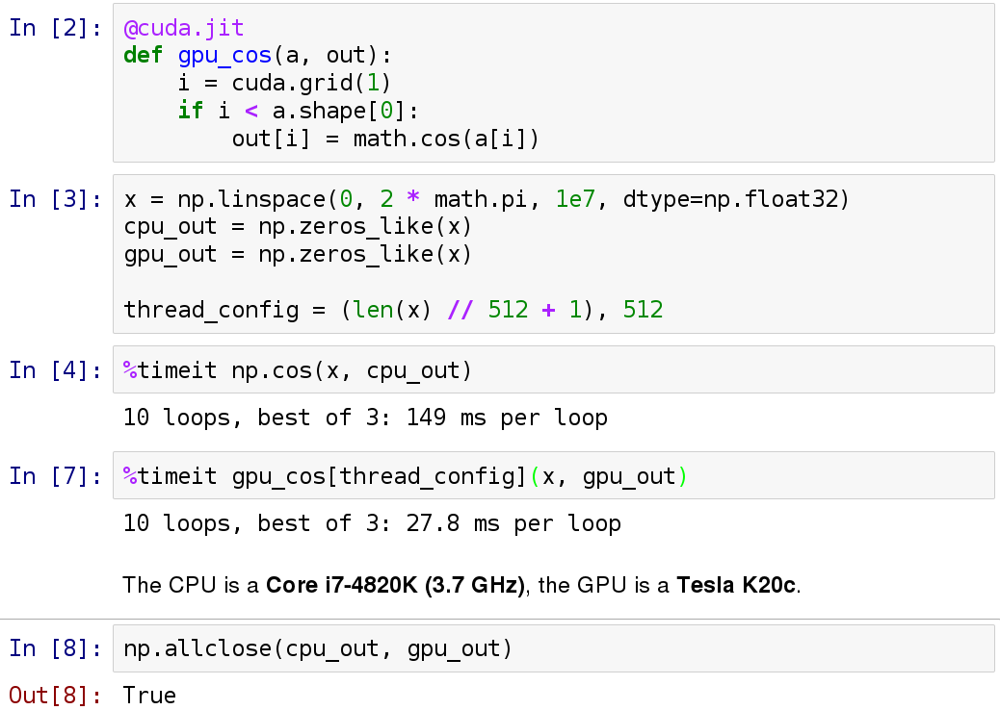

Numba, a JIT compiler for fast numerical code
=============================================

Speaker presentation
--------------------

* Antoine Pitrou <antoine@python.org>
   * Numba developer at Continuum since 2014
   * Core Python developer since 2007
   * *Not a scientist*

What is Numba?
--------------

* A just-in-time compiler based on LLVM
* Runs on CPython 2.6 to 3.4
* Opt-in
* Specialized in numerical computation
* BSD-licensed, cross-platform (Linux, OS X, Windows)

Why a just-in-time compiler?
----------------------------

* Pure Python is slow at number crunching

* Want C-like speed but without writing C (or Fortran!)

* Numpy has C accelerations, but they only apply to well-behaved problems
   - array operations are memory-heavy, can thrash CPU caches

* Many algorithms have irregular data access, per-element branching, etc.

* Fit for interactive use

Why a just-in-time compiler?
----------------------------

Mandelbrot (20 iterations):

+------------------------------+---------------------+
| CPython                      | 1x                  |
+------------------------------+---------------------+
| Numpy array-wide operations  | 13x                 |
+------------------------------+---------------------+
| Numba (CPU)                  | 120x                |
+------------------------------+---------------------+
| Numba (NVidia Tesla K20c)    | 2100x               |
+------------------------------+---------------------+

LLVM
----

* A mature library and toolkit for writing compilers (clang)
* Multi-platform
* Supported by the industry
* Has a wide range of integrated optimizations
* Allows us to focus on *Python*

LLVM optimizations
------------------

- inlining
- loop unrolling
- SIMD vectorization
- etc.

LLVM crazy optimizations
------------------------

Constant time arithmetic series

LLVM crazy optimizations
------------------------

Assembler output

Runs on CPython
---------------

* 2.6, 2.7, 3.3, 3.4, 3.5
* Can run side by side with regular Python code
* Can run side by side with all third-party C extensions and libraries
   - all the numpy / scipy / etc. ecosystem

Opt-in
------

* Only accelerate select functions decorated by you
* Allows us to relax *semantics* in exchange for speed
* High-level code surrounding Numba-compiled functions can be arbitrarily
  complex

Specialized
-----------

* Tailored for number crunching
* Tailored for Numpy arrays
* And a bunch of other things...

Multiple targets
----------------

* Main target is the CPU

  - officially supported: x86, x86-64

* CUDA target for NVidia GPUs with a limited feature set
* Potential support for:

  - HSA (GPU+CPU on AMD APUs)
  - ARM processors
  - ...

Numba architecture
------------------

* Straight-forward function-based JIT
* Compilation pipeline from Python bytecode to LLVM IR
* Low-level optimizations and codegen delegated to LLVM
* Python-facing wrappers

Compilation pipeline
--------------------

Numba types
-----------

* ``int8``, ``int16``, ``int32``, ``int64``, ``uint8``, ...
* typed tuples (e.g. ``(int8, float64)``)
* 1D contiguous arrays, 1D non-contiguous, 2D C-contiguous, etc.
* and so on

Numba specializations
---------------------

* "Lowering" pass generates LLVM code for specific types and operations
   - built-in types and operators
   - specific libraries (math, cmath, random...)

* Opens opportunities for inlining and other optimizations

Supported Python syntax
-----------------------

* Supported constructs:

  - if / else / for / while / break / continue
  - raising exceptions
  - calling other compiled functions
  - generators!
  - etc.

Unsupported Python syntax
-------------------------

* Unsupported constructs:

  - try/except/finally
  - with
  - (list, set, dict) comprehensions
  - yield from

Supported Python features
-------------------------

* Types:

  - int, bool, float, complex
  - tuple, None
  - bytes, bytearray, memoryview (and other buffer-like objects)

* Built-in functions:

  - abs, enumerate, len, min, max, print, range, round, zip

* Operators

Supported Python modules
------------------------

* Standard library:

  - cmath, math, random, ctypes...

* Third-party:

  - cffi, numpy

Supported Numpy features
------------------------

* All kinds of arrays
   - scalar
   - structured
   - except when containing Python objects

* Constructors : ``np.empty``, etc.

* Iterating, indexing, slicing

* Reductions: ``.argmax()``, ``.prod()``, etc.

* Scalar types and values (including ``datetime64`` and ``timedelta64``)

* ``numpy.random``

Limitations
-----------

* Recursion not supported
* Can't compile classes
* Type inference must be able to determine all types

Semantic changes
----------------

* Fixed-sized integers
* Global and outer variables frozen
* No frame introspection inside JIT functions:

  - tracebacks
  - debugging

Using Numba: @jit
-----------------

* @jit-decorate a function to designate it for JIT compilation

* Automatic lazy compilation (recommended)::

   @numba.jit
   def my_function(x, y, z):
       ...

* Manual specialization::

   @numba.jit("(int32, float64, float64)")
   def my_function(x, y, z):
       ...

GIL removal with @jit(nogil=True)
---------------------------------

* N-core scalability by releasing the Global Interpreter Lock::

   @numba.jit(nogil=True)
   def my_function(x, y, z):
       ...

* No protection from race conditions!

.. tip:: Use ``concurrent.futures.ThreadPoolExecutor`` on Python 3

Using Numba: @vectorize
-----------------------

* Compiles a scalar function into a **Numpy universal function**

* What is a universal function?

  - Examples: np.add, np.mult, np.sqrt...
  - Apply an element-wise operation on entire arrays
  - Automatic broadcasting
  - Reduction methods: np.add.reduce(), np.add.accumulate()...

* Traditionally requires coding in C

Using Numba: @guvectorize
-------------------------

* Compiles a element-wise or subarray-wise function into a generalized
  universal function

* What is a generalized universal function?

  - like a universal function, but allows to peek at other elements
  - e.g. moving window average
  - automatic broadcasting, but not automatic reduction methods

@jit example: Ising models
--------------------------

Ising model: code
-----------------

Ising model: performance
------------------------

+------------------------------+---------------------+
| CPython                      | 1x                  |
+------------------------------+---------------------+
| Numba (CPU)                  | 130x                |
+------------------------------+---------------------+
| *Fortran*                    | 275x                |
+------------------------------+---------------------+

CUDA support
------------

* Numba provides a @cuda.jit decorator

* Exposes the CUDA programming model

* Parallel operation:

  - threads
  - blocks of threads
  - grid of blocks

* Distinguishing between:

  - kernel functions (called from CPU)
  - device functions (called from GPU)

CUDA support
------------

* Limited array of features available

  - features requiring C helper code unavailable

* Programmer needs to make use of CUDA knowledge

* Programmer needs to take hardware capabilities into account

CUDA example
------------

Installing Numba
----------------

* Recommended: precompiled binaries with Anaconda or Miniconda::

   conda install numba

* Otherwise: install LLVM 3.6.x, compile llvmlite, install numba from source

Contact
-------

* Documentation at http://numba.pydata.org/

* Code and issue tracker at https://github.com/numba/numba/

* Numba-users mailing-list

* Numba is commercially supported (sales@continuum.io)

  - consulting
  - enhancements
  - support for new architectures
  - NumbaPro
